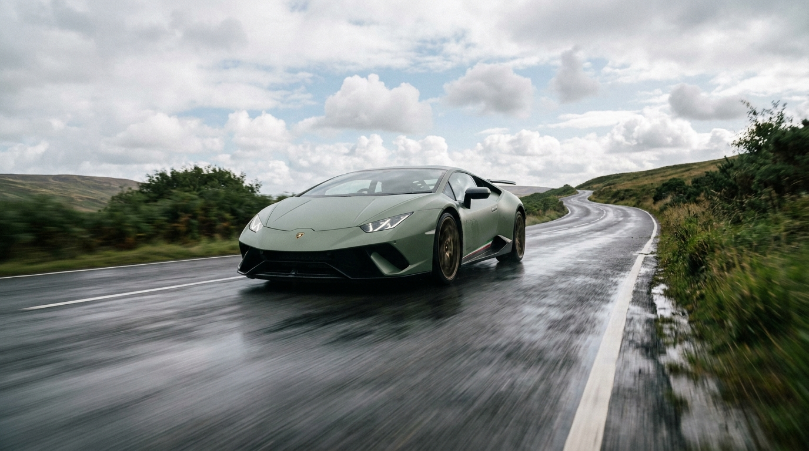

# PUSHING FRAMES_


Local, bring-your-own-keys cinematic prompt studio. Image and video generation across Seedream, Seedance, GPT-image-2, Gemini 3 Flash Image, Imagen, Veo 3, Kling, and OpenRouter—behind one cinematic-first UI.

The pack is the product. Every project is a markdown file you can read, edit, remix, commit to git, share. Twelve years of cinematography compressed into style blocks and shot templates. The tool is the delivery mechanism.

## Quick start

```
git clone <this-repo>
cd pushing-frames
npm install
npm run dev
```

Open the dev URL in **Chrome / Edge / Opera / Brave / Arc**—Safari and Firefox don't support the File System Access API the app relies on.

Set a vault passphrase. Paste your provider keys. Keys are encrypted locally with the passphrase and stored in your browser's IndexedDB. They never leave your machine.

## Easy launch (macOS, no terminal)

After running `npm run build` once, double-click `start.command` from Finder. Python 3 (preinstalled on macOS 12+) serves the production build at `localhost:8765` and your default browser opens to it. Close the Terminal window to stop.

## What's inside

- **`src/templates/cinematography/style.md`** — curated STYLE_/NEG_ block library that fights the most common AI failure modes (plastic skin, centred front-lit hero, flat noon lighting). No shots—a starting palette.
- **`src/templates/bmw/`** — annotated worked example. Real BMW M-Series Track Day pack, 6 shots showing the format end-to-end. Override every block with your own voice.
- **`docs/AUTHORING.md`** — interview protocol you can paste into Claude or Gemini to author your own master pack.
- **`docs/example_master_pack.md`** — a starting master pack you can drop into any project as your personal defaults.

## The thesis

> Stop prompting. Start defining outcomes.

Treat the AI like a director of photography you've hired. You don't tell a DP "make it cinematic"—you tell them ARRI Alexa 35, 50mm prime at T1.5, golden-hour rim from frame right, anamorphic squeeze, 24fps at 1/48 shutter, and you hand them three reference images.

Specificity isn't decoration. It's how you transfer years of being on set into a sentence the model can act on.

## Project Guide

After unlock, pick **Open Project** (existing folder with `style.md` + `storyboard.md`) or **Create New Project** to walk through the five-stage guide:

1. **Setup** — name, destination folder, starter template
2. **Concept** — project summary, mood notes, drop reference images
3. **Style** — camera/lens/aspect defaults, toggle STYLE_/NEG_ blocks
4. **Shots** — sortable shot list, per-shot Gemini auto-generate, bulk shot list generation via Gemini structured output
5. **Review** — preview the markdown that'll be written, then create

Click **edit guide** in the top bar of any open project to re-enter and amend.

## Constraints

- Pure browser, no install step
- Bring-your-own keys for every provider
- Cost-aware—pre-flight estimates and project budget caps
- Reference images conformed per-provider before send (resize, byte-cap, format)
- macOS desktop wrapper planned for Finder integration and full offline use

## Tech

Vite + React + TypeScript. Pure browser, File System Access API for project folders, IndexedDB-backed encrypted vault for vendor keys, Web Crypto for the passphrase-derived key. No backend, no telemetry, no analytics.

## License

MIT. See [LICENSE](./LICENSE).
